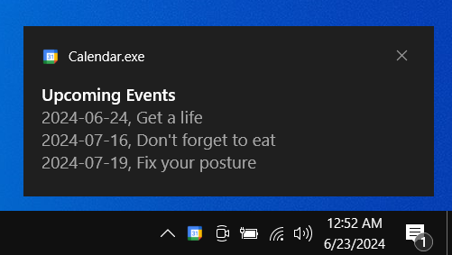

# Google Calendar Notifier

Tl;dr: if you're tired of forgetting events you wrote in your google calendar and you're a heavy pc user, this solves the problem (or helps avoid addressing the actual problem of forgetting)

#### Last Updated: June 23rd, 2024

## Table of Contents

1. [Introduction](#introduction)
2. [Features](#features)
3. [Installation](#installation)
4. [Usage](#usage)
5. [Limitations](#limitations)
6. [Why?](#why)

<a name="introduction"></a>
## Introduction

This project aims to provide a seamless way for users to keep track of their upcoming events by integrating with Google Calendar and displaying notifications on Windows 10. Upon logging in, users receive notifications of their next four events, helping them stay organized without manually checking their calendar.



<a name="features"></a>
## Features

- **Automated Event Retrieval**: Automatically fetches and display the top four upcoming events from Google Calendar.
- **Persistent Notifications**: Displays notifications that stay in the Windows action center after initially showing for 3 seconds.
- **Task Scheduler Integration**: Creates a task that runs the main script on user login.
- **User-Friendly**: Minimal setup required with automatic execution on login.

<a name="installation"></a>
## Installation

Make sure you have [Python](https://www.python.org/downloads/) installed.

Follow these steps to set up the environment and run the application:


1. Clone the Repository:
   ```bash
   git clone https://github.com/Sambonic/google-calendar-notifier
   ```
   ```bash
   cd google-calendar-notifier
   ```

2. Create a Python Virtual Environment:
   ```bash
   python -m venv env
   ```

3. Activate the Virtual Environment:
   - On Windows:
     ```
     env\Scripts\activate
     ```
4. Ensure Pip is Up-to-Date:
   ```
   python.exe -m pip install --upgrade pip
   ```
5. Install Dependencies:

   ```bash
   pip install -r requirements.txt
   ```

<a name="usage"></a>
## Usage

To begin you have to first setup your credentials file through the following steps:

1. Visit https://console.cloud.google.com/apis/credentials
2. Press 'Create Credentials' button
3. Choose 'OAuth client ID'
4. Application Type: Desktop, Name: Anything
5. Press 'Create'
6. Download the json file and paste it in the ['credentials'](https://github.com/Sambonic/google-calendar-notifier/tree/main/credentials) and the [other 'credentials'](https://github.com/Sambonic/google-calendar-notifier/tree/main/output/Calendar/_internal/credentials) folder
7. Run the Calender.exe in the [Calender folder](https://github.com/Sambonic/google-calendar-notifier/tree/main/output/Calendar)
8. It will ask you to sign in to get to give authorization to the API. Press Continue.
9. token.json file should be generated in the [other 'credentials' folder](https://github.com/Sambonic/google-calendar-notifier/tree/main/output/Calendar/_internal/credentials)
10. Copy it into the other folder and all is set

**Note:** Due to the nature of the project, i.e. automatically running commands to setup the task in the background, it may trigger false warnings from windows defender.

<a name="limitations"></a>
## Limitations

- **API Quotas**: Google Calendar API has usage quotas. Ensure your use case does not exceed free tier limits.
- **Windows Only**: This project is designed specifically for Windows 10 and may not work on other operating systems.
- **Dependency on Google Calendar**: The project requires a Google Calendar account and proper API setup.

<a name="why"></a>
## Why?

This project was undertaken to simplify the process of staying updated with upcoming events directly from Google Calendar without manual checks. It also serves as a practical learning experience in integrating Google APIs, working with Windows notifications, and using Task Scheduler for automation. The goal is to leverage this knowledge in more complex automation and notification systems in the future.
